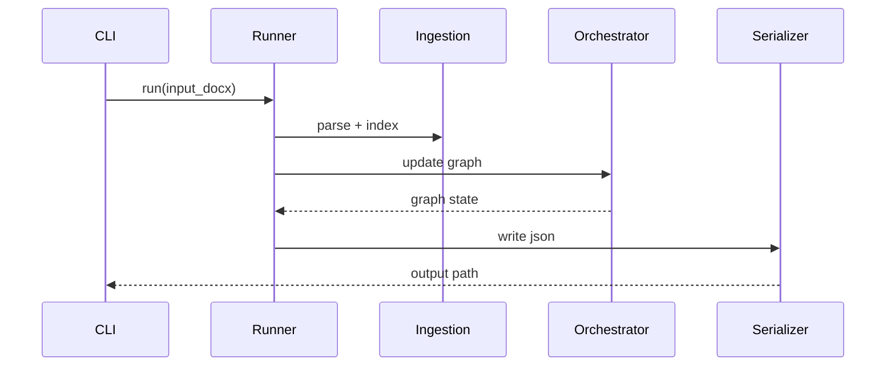
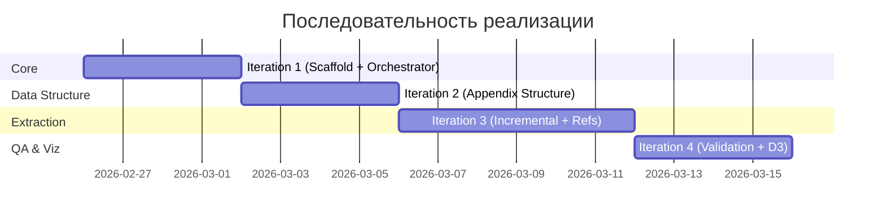

# Implementation Plan: Регистрация ценных бумаг - регуляторный граф

## Цель

Построить инкрементальный конвейер извлечения требований из 706-П в графовую модель LPG с трассировкой к источнику (`legal_ref`) и поддержкой последующей аналитики/визуализации.

План ориентирован на ранний запуск детерминированного каркаса (ядро и наблюдаемость) с поэтапным подключением более сложных извлекающих этапов.

## Обзор модулей

### Архитектурная схема

```mermaid
flowchart TD
    source[Source706PDocx] --> phase1[DocumentIngestion]
    phase1 --> phase2[AppendixStructureExtractor]
    phase2 --> phase3[IncrementalKnowledgeExtraction]
    phase3 --> orchestrator[GraphOrchestrator]
    orchestrator --> phase4[ReferenceResolver]
    phase4 --> phase5[ValidationAndQA]
    phase5 --> output[Graph JSON + Artifacts]
    output --> viz[Visualization Stage 1 (D3)]
```

### Описание модулей

**DocumentIngestion**
- Назначение: парсинг DOCX и построение индексов пунктов/приложений.
- Зависимости: `python-docx` (или эквивалентный reader), файловая система.
- Предоставляет: индекс пунктов, индекс приложений, порядок обхода.

**AppendixStructureExtractor**
- Назначение: предварительное построение подграфа форм приложений.
- Зависимости: индекс приложений из DocumentIngestion.
- Предоставляет: узлы `document_section`, `document_field`, `field_group`.

**IncrementalKnowledgeExtraction**
- Назначение: извлечение фактов по окнам текста глав.
- Зависимости: индексы и подграф приложений.
- Предоставляет: кандидаты узлов/рёбер, ссылки, условия, `pending_refs`.

**GraphOrchestrator**
- Назначение: детерминированное обновление графа, управление ID и реестром.
- Зависимости: результаты фаз 2/3.
- Предоставляет: консистентный LPG JSON и реестр сущностей.

**ReferenceResolver**
- Назначение: доразбор и связывание `pending_refs`.
- Зависимости: итог графа после фазы 3.
- Предоставляет: обновленные связи и список нерезолвленных ссылок.

**ValidationAndQA**
- Назначение: контроль полноты, консистентности и аномалий.
- Зависимости: финальный граф и артефакты фаз.
- Предоставляет: отчеты валидации, список рисков/аномалий.

**VisualizationStage1**
- Назначение: визуальная инспекция подграфов и связей.
- Зависимости: граф JSON.
- Предоставляет: локальную D3-визуализацию с фильтрами и инспекцией свойств.

## Итерация 1: Core Scaffold и детерминированный графовый каркас

**Цель:** Поднять исполняемый Python-каркас конвейера, модели LPG и оркестратор состояния без LLM-слоя.

**Модули для реализации:**
1. `pipeline` (шаблон фаз и связность конвейера)
2. `graph_model` (узлы/рёбра/граф)
3. `graph_orchestrator` (ID, upsert, pending refs)
4. `cli` (запуск пайплайна и сохранение JSON артефактов)

**Интерфейсы:**

### GraphModel

```python
from dataclasses import dataclass, field
from typing import Any, Dict, List

@dataclass
class GraphNode:
    id: str
    type: str
    properties: Dict[str, Any] = field(default_factory=dict)

@dataclass
class GraphEdge:
    id: str
    type: str
    source: str
    target: str
    properties: Dict[str, Any] = field(default_factory=dict)

@dataclass
class GraphState:
    nodes: Dict[str, GraphNode] = field(default_factory=dict)
    edges: Dict[str, GraphEdge] = field(default_factory=dict)
    pending_refs: List[Dict[str, Any]] = field(default_factory=list)
    fz_questions: List[Dict[str, Any]] = field(default_factory=list)
```

### GraphOrchestrator

```python
class GraphOrchestrator:
    def add_or_update_node(self, node_type: str, natural_key: str, properties: dict) -> str: ...
    def add_edge(self, edge_type: str, source_id: str, target_id: str, properties: dict) -> str: ...
    def add_pending_ref(self, source_id: str, ref_text: str, context: dict) -> None: ...
    def to_json(self) -> dict: ...
```

### PipelinePhase

```python
class PipelinePhase:
    phase_name: str
    def run(self, context: dict) -> dict: ...
```

**Стратегия моков для Итерации 1:**
- LLM-экстракция: stub-фаза с фиксированным выходом (`IncrementalKnowledgeExtractionStub`).
- DOCX parsing: допускается fallback на локальный plain-text sample, если DOCX недоступен.
- Внешние ФЗ: не извлекаются, формируются записи в `fz_questions`.

**Критерии готовности:**
- [ ] Фазы конвейера запускаются последовательно в одном `PipelineRunner`.
- [ ] Граф и оркестратор сериализуют результат в JSON.
- [ ] Поддерживаются `pending_refs` и `fz_questions` как сервисные артефакты.
- [ ] Запуск через CLI создает артефакт в `03_data/`.

**Визуализация итерации:**



## Итерация 2: Appendix Structure и подготовка контекста ссылок

**Цель:** Извлекать структуру форм из приложений в отдельный подграф до основной extraction-фазы.

**Модули для реализации:**
1. `appendix_structure_extractor`
2. `appendix_index` (service adapter к результатам ingestion)
3. `orchestrator` расширение для `document_section/document_field/field_group`

**Интерфейсы:**

```python
class AppendixStructureExtractor:
    def extract(self, appendix_index: dict) -> list[dict]: ...

class GraphOrchestrator:
    def upsert_document_section(self, appendix_id: str, section_path: str, properties: dict) -> str: ...
    def upsert_document_field(self, section_id: str, field_code: str, properties: dict) -> str: ...
```

**Стратегия моков для Итерации 2:**
- Если часть приложений распознается неоднозначно, фиксировать в `extraction_warnings`, но не блокировать итерацию.
- Утраченные формы (`утратили силу`) писать в журнал обработки, не в основной граф.

**Критерии готовности:**
- [ ] Подграф приложений строится до фазы извлечения фактов из глав.
- [ ] Поля и секции имеют `legal_ref`.
- [ ] Появился журнал исключенных/утраченных элементов.

## Итерация 3: Incremental Knowledge Extraction + pending refs lifecycle

**Цель:** Реализовать инкрементальное извлечение фактов по окнам глав и управляемый цикл `pending_refs`.

**Модули для реализации:**
1. `chapter_map_builder`
2. `window_extractor`
3. `reference_resolver`
4. `entity_registry_matching`

**Интерфейсы:**

```python
class WindowExtractor:
    def extract_facts(self, chapter_window: dict, context_slice: dict) -> dict: ...

class ReferenceResolver:
    def resolve(self, pending_refs: list[dict], graph_state: dict) -> dict: ...
```

**Стратегия моков для Итерации 3:**
- LLM-инструменты чтения (`get_paragraphs`, `get_appendix`) временно заменяются adapter-слоем с детерминированным интерфейсом.
- Семантическое сопоставление сущностей допускает conservative mode (без агрессивного merge).

**Критерии готовности:**
- [ ] Результаты extraction привязываются к `legal_ref`.
- [ ] `pending_refs` уменьшается после resolver-прохода.
- [ ] Нерезолвленные ссылки фиксируются в отчете для ручной валидации.

## Итерация 4: Validation/QA + Visualization Stage 1

**Цель:** Получить проверяемый контур качества и удобную инспекцию подграфов.

**Модули для реализации:**
1. `validation_qa`
2. `anomaly_reporter`
3. `viz_stage1` (D3, локальный статический запуск)

**Интерфейсы:**

```python
class ValidationQA:
    def run(self, graph_state: dict) -> dict: ...

class AnomalyReporter:
    def build_report(self, graph_state: dict, qa_result: dict) -> dict: ...
```

**Стратегия моков для Итерации 4:**
- Проверки полноты по типам бумаг стартуют с rule-based baseline, затем расширяются.
- Визуализация использует локальный JSON snapshot без backend API на первом этапе.

**Критерии готовности:**
- [ ] Генерируются отчеты по полноте/консистентности.
- [ ] Визуализация показывает окрестности узлов и свойства рёбер.
- [ ] Фиксируются аномалии: дубликаты, weak match, нерезолвленные ссылки.

## Критический путь



**Критическая цепочка:**
1. Core scaffold и GraphOrchestrator.
2. Предварительный подграф приложений.
3. Инкрементальное извлечение и резолвер ссылок.
4. QA-контур и визуальная инспекция.

**Параллельные работы:**
- В рамках Iteration 3 можно параллелить `entity_registry_matching` и расширение `reference_resolver`.
- В Iteration 4 QA-правила и D3 UI могут развиваться параллельно после фиксации JSON-контракта.

## Интерфейсы между модулями

### DocumentIngestion -> AppendixStructureExtractor

```python
ingestion_output = {
    "paragraph_index": dict,
    "appendix_index": dict,
    "traversal_plan": list[dict],
}
```

### IncrementalKnowledgeExtraction -> GraphOrchestrator

```python
extraction_output = {
    "nodes": list[dict],
    "edges": list[dict],
    "references": list[dict],
    "fz_questions": list[dict],
}
```

### GraphOrchestrator -> ReferenceResolver

```python
resolver_input = {
    "graph_state": dict,
    "pending_refs": list[dict],
}
```

**Гарантии контрактов:**
- Каждый факт должен иметь `legal_ref`.
- `id` создается только оркестратором.
- Фазы не модифицируют граф напрямую, только через API оркестратора.

## Стратегия наблюдаемости

**Логирование:**
- JSON-логи по фазам в `04_logs/`.
- Минимальные поля: `phase`, `event`, `duration_ms`, `items_processed`, `errors_count`.

**Сервисные артефакты:**
- `pending_refs.json`
- `fz_questions.json`
- `validation_report.json`

**Операционный контроль:**
- CLI возвращает путь к артефактам и агрегированную статистику прогона.

## Ограничения планирования и зафиксированные неопределенности

- ADR-файлы (`00_docs/architecture/decision_*.md`) на момент планирования отсутствуют.
- План не вводит новых архитектурных решений сверх `overview.md`; при появлении ADR порядок итераций должен быть перепроверен.
- Доступ к проектам-источникам, упомянутым в процессе Tech Lead, явно не зафиксирован в текущем репозитории.
