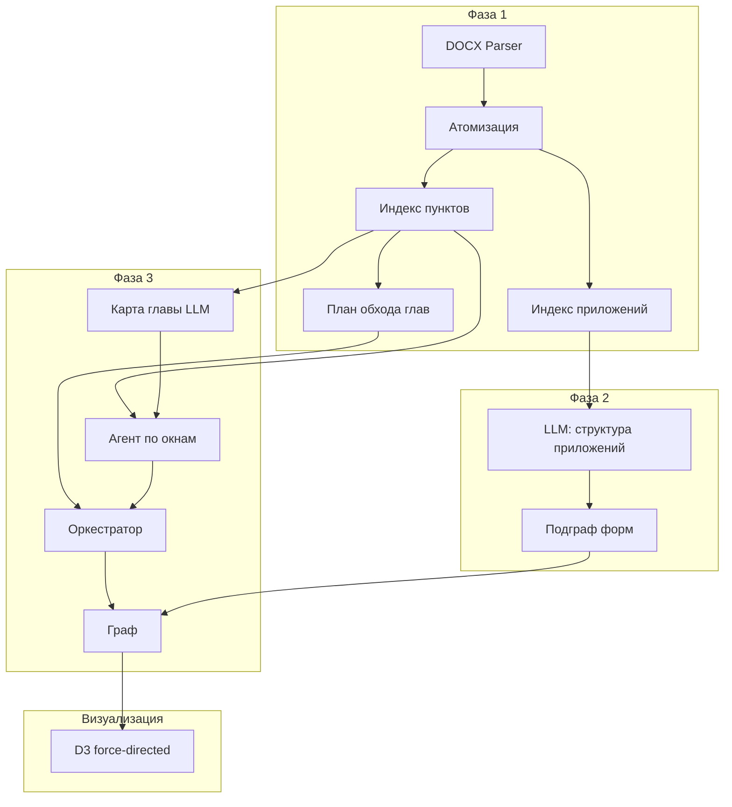
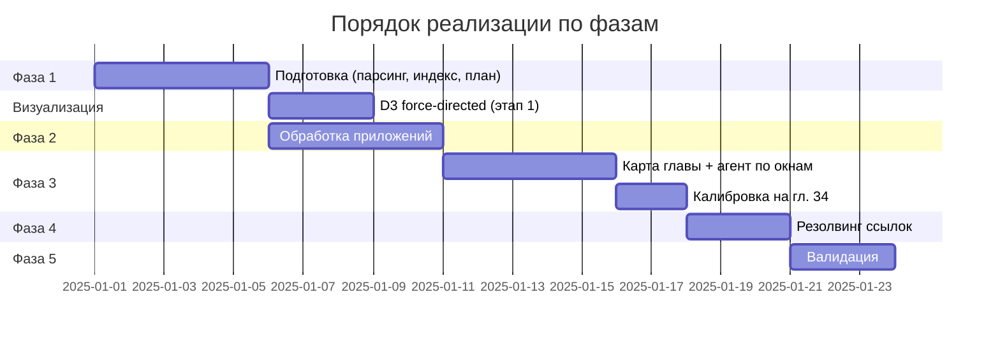

# Implementation Plan: Граф знаний по 706-П

**Источники:** `00_docs/specs/task_specification.md`, `00_docs/specs/calibration_chapter34.md`

## Цель

Построить конвейер обработки Положения Банка России №706-П (DOCX), формирующий граф знаний (Labeled Property Graph) в JSON: регистрационные действия, требуемые документы, факторы и условия. Результат — ответ на вопрос «какие документы требуются для конкретного регистрационного действия при заданных параметрах». Порядок реализации строго по фазам спецификации: Подготовка → Приложения → Инкрементальное извлечение → Резолвинг ссылок → Валидация.

---

## Обзор конвейера

### Схема фаз

### Зависимости модулей

---

## Правила выбора моделей и запусков

| Назначение | Модель | Обоснование |
|------------|--------|-------------|
| Общие задачи (карта главы, извлечение фактов из окна, структура приложений, нечёткое сравнение в типичных случаях) | `gpt-5-mini` | Достаточная точность при меньшей стоимости и латентности |
| Сложные задачи (многозначные условия, составные ссылки, разрешение аномалий, нечёткое сравнение при конфликтах) | `gpt-5` | Требуется более глубокий анализ текста и контекста |

**Критерии «сложная задача»:** неоднозначность в разбиении условия (развилка vs. ребро), несколько кандидатов при нечётком сравнении с близкой уверенностью, разрешение противоречий в валидации.

**Реализация:** выбор модели задаётся конфигурацией (например, по имени фазы/операции); по умолчанию — `gpt-5-mini`.

---

## Runtime-ограничения

| Ограничение | Значение | Область применения |
|-------------|----------|---------------------|
| Размер окна текста (основная часть) | до 10 000 токенов | Фаза 3: нарезка по пунктам, одно окно = один вызов агента |
| Количество глав за прогон | не более одной главы | Фаза 3: один запуск конвейера обрабатывает одну главу |
| Предварительный прогон (калибровка) | одна глава | Прогон на главе 34 по спецификации calibration_chapter34.md |

Нарезка окон: адаптивная по пунктам, целевой размер окна ~2–3K токенов (калибровка гл. 34); верхняя граница одного окна — 10K токенов. Границы только по границам пунктов (не разрезать пункт).

---

## Инженерные императивы

1. **Окружение:** все запуски только в `.venv` проекта.
2. **LLM:** вызовы только реальные через OpenAI API. Переменные окружения (загружаются из `.env`):
   - `OPENAI_API_KEY` — ключ API;
   - `OPENAI_BASE_URL` — базовый URL (при необходимости кастомного эндпоинта).
   Дополнительные переменные, если появятся (например, для выбора модели или лимитов), будут зафиксированы в плане и переданы вам для присвоения значений.
3. **Без моков LLM:** там, где спецификация предполагает использование LLM (извлечение фактов, карта главы, приложения, нечёткое сравнение, резолвинг ссылок, валидация), подставлять моки или заглушки запрещено.
4. **Без эвристик вместо LLM:** в местах, где спецификация явно отводит решение LLM (сопоставление сущностей при неоднозначности, классификация типа пункта «документы»/«правило», извлечение условий), не заменять их эвристическими правилами.
5. **Типы узлов/рёбер и JSON:** типы узлов, типы рёбер и структура JSON (узлы, рёбра, `pending_refs`, `fz_questions`) должны строго соответствовать разделам 3.2–3.3 task_specification.md и примерам в calibration_chapter34.md. Выход модели парсится и маппится в эти контракты; «свободный» вывод модели не подставляется в граф без маппинга в заданные типы и поля.
6. **ID:** присвоение ID — только алгоритмом. Конвенция: `{тип}:{числовой автоинкремент}` (например `ra:0001`, `doc:0001`, `f:0001`, `fv:0001`, `e:0001`). LLM не генерирует ID.

---

## Контракты данных (из спецификаций)

Типы узлов и рёбер, а также формат JSON — по task_specification.md §3.2–3.3 и calibration_chapter34.md §4. Ключевые типы узлов: `registration_action`, `document`, `security_type`, `factor`, `factor_value`, `document_section`, `document_field`, `field_group`, `legal_reference`. Типы рёбер: `requires_document`, `replaces_document`, `excludes_document`, `branches_by`, `when_value`, `belongs_to`, `contains_field`, `same_as`, `variant_of`, `reused_in`, `defined_by`, `cross_references`. Свойства рёбер (например `legal_ref`, `condition`, `factor_value_id`) — по спецификации. Формат ответа LLM для Фазы 3 — JSON из промпта уровня 2 (calibration_chapter34.md §2.2); алгоритм преобразует его в узлы/рёбра графа с присвоением ID и разрешением сущностей через реестр.

---

## Фаза 1: Подготовка (детерминированная, без LLM)

**Цель:** получить индексированную базу пунктов и приложений 706-П и план обхода глав.

**Вход:** один файл 706-П в формате DOCX.

**Операции:**
1. Парсинг DOCX с сохранением структуры заголовков (python-docx).
2. Атомизация: каждый пункт — отдельная запись с метаданными (номер пункта, глава, раздел).
3. Индекс «номер пункта → текст пункта» (для tool calling).
4. Индекс «номер приложения → текст приложения».
5. План обхода: топологическая сортировка глав по зависимостям (граф зависимостей из спецификации).

**Выход (артефакты):**
- Индексированная база пунктов (SQLite с FTS5 или файловая система).
- Индекс приложений.
- Файл/структура плана обхода (порядок глав).

**Контракты:**
- **Вход:** путь к DOCX.
- **Выход:** интерфейс доступа к пункту по номеру, к приложению по номеру, к списку глав в порядке обхода.

**Definition of Done (Фаза 1):**
- [ ] DOCX успешно парсится; заголовки и пункты извлекаются без потери структуры.
- [ ] По номеру пункта (например 34.5) возвращается полный текст пункта.
- [ ] По номеру приложения возвращается текст приложения.
- [ ] План обхода содержит все главы 706-П в допустимом порядке (ветви по спецификации).
- [ ] Проверка на главе 34: пункты 34.1–34.17 доступны по индексу, токеновый объём главы измерим (для нарезки окон).
- [ ] Код выполняется в `.venv`, без вызовов LLM.

---

## Фаза 2: Обработка приложений (скрипт + LLM)

**Цель:** построить подграф форм документов (разделы → подразделы → поля) из приложений 1–39.

**Вход:** тексты приложений из индекса (Фаза 1).

**Операции:**
1. Для каждого приложения — вызов LLM с промптом §2.4 calibration_chapter34: извлечение иерархии разделов и полей.
2. Алгоритм: присвоение ID, создание узлов (`document`, `document_section`, `document_field`, `field_group`) и рёбер (`belongs_to`, `contains_field`, `reused_in` и т.д.).
3. Выявление повторяющихся полей/групп между приложениями с привлечением LLM для нечёткого сравнения (промпт §2.3).
4. Элементы «Утратили силу» не включаются в граф, только в `deprecated_elements` и логи.

**Выход (артефакты):**
- Подграф форм документов (узлы и рёбра в общем формате графа).
- Лог утративших силу элементов.

**Контракты:**
- **Вход:** индекс приложений (Фаза 1); конфиг LLM (модель, API).
- **Выход:** фрагмент графа (nodes + edges) в JSON-формате спецификации; типы узлов/рёбер строго по спецификации.

**Definition of Done (Фаза 2):**
- [ ] Обработано хотя бы одно приложение (например, одно из 1–39) с получением дерева разделов и полей.
- [ ] Узлы имеют типы `document`, `document_section`, `document_field` (и при необходимости `field_group`); рёбра — `belongs_to` и др. по спецификации.
- [ ] ID присваиваются алгоритмом (конвенция префиксов).
- [ ] Элементы «Утратили силу» отсутствуют в графе и присутствуют в логе/массиве deprecated.
- [ ] LLM вызывается реально (OpenAI через .env), без моков.
- [ ] Запуск только в `.venv`.

---

## Фаза 3: Инкрементальное извлечение (LangGraph-агент + оркестратор)

**Цель:** по одной главе за прогон обрабатывать текст глав 706-П, накапливая в графе регистрационные действия, документы, факторы, условия и ссылки; предварительный прогон — одна глава (калибровка на главе 34).

**Вход:** индекс пунктов и план обхода (Фаза 1); подграф приложений (Фаза 2); выбор главы для обработки; конфиг моделей и лимитов.

**Операции:**
1. **Уровень 1 — карта главы:** LLM по полному тексту главы (промпт §2.1 calibration_chapter34) возвращает компактную карту (тема, пункты с типом «документы»/«правило», факторы). Размер карты — в пределах контекста вместе с окном (до ~500 токенов по спецификации).
2. **Уровень 2 — окна:** нарезка главы на окна по границам пунктов, ~2–3K токенов на окно, макс. 10K токенов на окно. Для каждого окна:
   - Оркестратор формирует контекст: текст окна, карта главы, компактный реестр сущностей, pending_refs с target в текущем диапазоне.
   - Агент (LangGraph, ReAct) с tools `get_paragraphs(numbers[])`, `get_appendix(number)` получает окно и возвращает JSON по формату промпта §2.2.
   - Алгоритм: сопоставление с реестром (точный поиск → при неоднозначности вызов LLM нечёткого сравнения §2.3), присвоение ID, создание узлов и рёбер, обновление pending_refs и реестра.
3. Ссылки: назад — через tools; вперёд — в pending_refs; на приложение — резолв через индекс; на ФЗ — в бэклог `fz_questions` (формат task_specification §2.3).
4. Калибровка: предварительный прогон на одной главе (глава 34); ожидаемые диапазоны узлов/рёбер — по calibration_chapter34 §6.

**Выход (артефакты):**
- Обновлённый граф (nodes, edges).
- `pending_refs` (unresolved для Фазы 4).
- `fz_questions` (бэклог вопросов к ФЗ).
- Чеклист обработанных глав/пунктов.

**Контракты:**
- **Вход:** номер/идентификатор главы; индекс пунктов; подграф приложений; реестр сущностей (или пустой); конфиг LLM и лимиты.
- **Выход:** граф в JSON; типы узлов/рёбер и свойства строго по спецификации; ID только от алгоритма; ответ агента валидируется и маппится в контракт (не «свободный» вывод).

**Definition of Done (Фаза 3):**
- [ ] Карта главы для выбранной главы строится и умещается в заданный лимит токенов.
- [ ] Окна нарезаются по границам пунктов; размер окна не превышает 10K токенов.
- [ ] Один прогон обрабатывает не более одной главы.
- [ ] Для главы 34 (калибровка): получены узлы типов `registration_action`, `document`, `factor`, `factor_value` и рёбра `requires_document`, `branches_by`, `when_value` в ожидаемых диапазонах (§6 calibration); часть пунктов в `skipped_paragraphs` (34.14–34.17); ссылки на главу 5 в `pending_refs`; ссылки на ФЗ в `fz_questions`.
- [ ] Tools `get_paragraphs` и `get_appendix` реализованы через индекс (без LLM).
- [ ] Нечёткое сравнение выполняется через LLM (промпт §2.3), не эвристикой.
- [ ] LLM-вызовы реальные; окружение `.venv`, переменные из `.env`.
- [ ] JSON ответа агента парсится и приводится к типам/полям спецификации.

---

## Фаза 4: Резолвинг оставшихся ссылок (скрипт + LLM)

**Цель:** разрешить все `pending_refs` со статусом `unresolved`, установив связи в графе; неразрешимые пометить для ручной валидации.

**Вход:** граф; реестр `pending_refs` с `status: unresolved`; индекс пунктов.

**Операции:**
1. Для каждой неразрешённой ссылки: извлечь текст целевого пункта из индекса.
2. LLM: контекст (текст пункта + ссылающаяся сущность) → установить связь (какой узел/ребро связать с целевым пунктом).
3. Алгоритм обновляет граф (рёбра `defined_by`, `cross_references` или атрибуты по спецификации).

**Выход (артефакты):**
- Граф с обновлёнными связями для разрешённых ссылок.
- Список ссылок, оставшихся неразрешёнными (для ручной валидации).

**Контракты:**
- **Вход:** граф (JSON); массив `pending_refs` (unresolved); индекс пунктов.
- **Выход:** обновлённый граф; массив неразрешённых ссылок с пометкой.

**Definition of Done (Фаза 4):**
- [ ] Для каждой unresolved ссылки выполняется попытка резолва (текст пункта + LLM).
- [ ] Разрешённые ссылки отражены в графе (рёбра/атрибуты по спецификации).
- [ ] Неразрешённые ссылки выведены отдельным артефактом с идентификатором и контекстом.
- [ ] LLM не мокируется; запуск в `.venv` с `.env`.

---

## Фаза 5: Валидация (диалог с Claude / скрипт с LLM)

**Цель:** проверить полноту и консистентность графа, разрешить аномалии; выборочная сверка с текстом.

**Операции (по спецификации):**
1. Полнота по типам бумаг (п. 2.1 task_specification): для каждого типа — покрыты ли все регистрационные действия?
2. Консистентность: отсутствие противоречивых рёбер.
3. Разрешение аномалий: неразрешённые ссылки, дубликаты с низкой confidence.
4. Выборочная сверка с текстом для нескольких сценариев.

Сверка с ФЗ не в скоупе — только бэклог `fz_questions`.

**Вход:** граф (после Фазы 4); список типов ценных бумаг (п. 2.1); при необходимости — индекс пунктов.

**Выход (артефакты):**
- Отчёт о полноте и консистентности.
- Список аномалий и рекомендации по ручной проверке.
- При возможности — обновлённый граф после автоматического разрешения части аномалий (с использованием LLM, не эвристик).

**Definition of Done (Фаза 5):**
- [ ] Выполнена проверка полноты по типам бумаг из п. 2.1.
- [ ] Выполнена проверка на противоречивые рёбра.
- [ ] Неразрешённые ссылки и дубликаты с низкой confidence зафиксированы в отчёте.
- [ ] Выполнена хотя бы одна выборочная сверка с текстом (сценарий описан, результат зафиксирован).
- [ ] Где спецификация предполагает LLM (разрешение аномалий) — используется реальный LLM, не моки.

---

## Визуализация (этап 1, для контроля парсинга)

**Цель:** оперативная проверка корректности извлечённых данных при итеративной разработке.

**Место в порядке реализации:** после Фазы 1 (чтобы при появлении графа можно было визуализировать срезы). Полноценное использование — после накопления графа в Фазах 2–3.

**Вход:** JSON графа (формат конвейера).

**Требования:** force-directed graph (D3); узлы по типу; при наведении — свойства; при клике — подсветка связей; фильтрация по типу узла/ребра; выбор корневого узла и окрестности (1–3 хопа); масштаб и перетаскивание; локальная веб-страница. Срезы до ~100–150 узлов.

**Definition of Done (Визуализация):**
- [ ] Страница открывается локально; загружается JSON графа.
- [ ] Узлы отображаются и окрашены по типу; рёбра отображаются.
- [ ] Реализованы: tooltip свойств, подсветка связей по клику, фильтр по типу, выбор корня и окрестности (1–3 хопа).
- [ ] Ограничение среза до ~100–150 узлов соблюдается или документировано.

---

## Критический путь и порядок задач

**Последовательность:** Фаза 1 → (Фаза 2 и Визуализация могут планироваться после Фазы 1) → Фаза 3 → Фаза 4 → Фаза 5. Калибровка (одна глава) — часть Фазы 3, предварительный прогон на главе 34.

---

## Реализация с помощью субагентов

- План выполняется через субагентов: каждая задача (фаза или выделенная подзадача в рамках фазы) передаётся отдельному агенту с полным контекстом из этого плана и соответствующих спецификаций.
- Контракты вход/выход, DoD и императивы передаются в постановку задачи субагента без замены на «см. план» — копируются в task_brief.
- После каждой задачи — проверка по DoD соответствующей фазы; при необходимости — итерация до выполнения всех пунктов DoD.
- Выбор модели (gpt-5-mini / gpt-5) и runtime-ограничения соблюдаются в коде и конфиге, создаваемом субагентами.

---

## Вопросы на уточнение (недостающее в спецификациях)

1. **Точный путь к файлу 706-П:** где в репозитории или на диске ожидается входной DOCX (например `03_data/01_source_files/706-P.docx`)? Нужна ли поддержка нескольких файлов (редакции)?
2. **Формат плана обхода:** предпочтительный формат хранения (JSON, YAML, модуль Python с константой) и точная структура графа зависимостей глав (список ветвей и порядок глав внутри ветвей) — в спецификации приведена схема, но не машиночитаемый список.
3. **Переменные окружения:** кроме `OPENAI_API_KEY` и `OPENAI_BASE_URL` планируются ли переменные для выбора модели (например `OPENAI_MODEL_DEFAULT`, `OPENAI_MODEL_COMPLEX`) или лимитов? Если да — добавлю в план и запрошу у вас присвоение значений.
4. **Хранение графа:** спецификация упоминает «JSON на диске с периодическими снапшотами». Нужен ли единый путь/именование (например `03_data/02_processed/graph_snapshot_*.json`) и политика снапшотов (после каждой главы, по запросу)?
5. **Бэклог fz_questions:** куда сохранять (отдельный файл, поле в графе, оба)? Нужен ли единый накопительный файл по всем главам?
6. **Валидация (Фаза 5):** «диалог с Claude» — предполагается ли интерактивный сценарий (пользователь в чате) или автоматический скрипт с вызовами API и фиксированными промптами? От этого зависит постановка задачи для субагента.
7. **Параллельная обработка ветвей:** в спецификации указано «последовательная обработка на первом этапе». Подтверждаем ли, что в первой версии плана все ветви обрабатываются строго последовательно (одна глава за прогон, порядок по плану обхода)?

После ответов на эти пункты план можно уточнить (пути, форматы, переменные окружения) без изменения фазовой структуры и контрактов.
