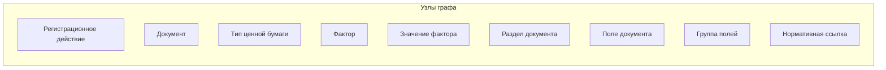
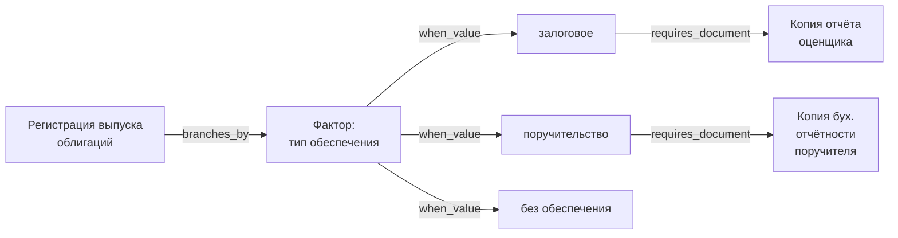
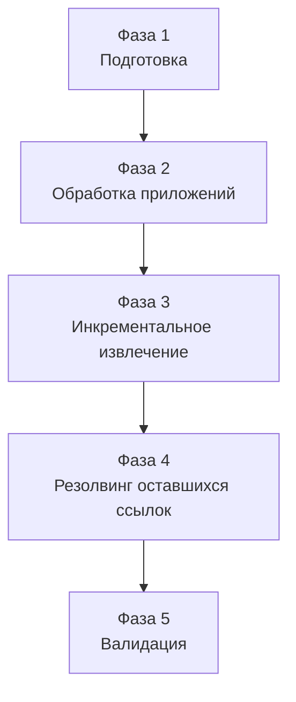
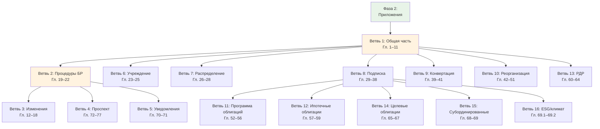

# Постановка задачи: построение графа знаний по 706-П

## 1. Цель проекта

Построить полную структурированную модель (граф знаний) требований к документам при регистрации ценных бумаг в Российской Федерации, на основании Положения Банка России №706-П.

Граф отвечает на вопрос: **какие документы требуются для конкретного регистрационного действия при заданном наборе параметров** (тип бумаги, юрформа эмитента, вид подписки и т.д.).

Конечный результат — JSON-представление графа, пригодное для:
- Визуализации (интерактивные диаграммы)
- Формирования пакетов документов по заданным параметрам
- Анализа и оптимизации регуляторных процессов
- Перехода к XSD-схемам документов

## 2. Покрытие

### 2.1. Типы ценных бумаг
- Акция обыкновенная
- Акция привилегированная
- РДР (российская депозитарная расписка)
- Облигация корпоративная
- Облигация структурная
- Облигация конвертируемая
- Облигация субординированная
- Облигация с ипотечным покрытием
- Опцион эмитента

### 2.2. Регистрационные действия (полный цикл)
Полный перечень регистрационных действий извлекается из 706-П на этапе обработки. Предварительный (неполный) список:
- Регистрация выпуска
- Регистрация дополнительного выпуска
- Регистрация проспекта ценных бумаг
- Регистрация программы облигаций
- Регистрация изменений (в решение о выпуске, в проспект, в программу облигаций, в условия размещения)
- Предварительное рассмотрение документов
- Отчёт об итогах выпуска / уведомление об итогах
- Уведомления (о представителе владельцев облигаций, о залоговых счетах, об изменении сведений, и др.)
- Аннулирование / признание выпуска несостоявшимся
- Приобретение публичного статуса

Допускается, что регистрационные действия образуют иерархию. Структура иерархии уточняется при обработке текста.

### 2.3. Нормативные источники
- **Основной:** Положение Банка России №706-П (DOCX)
- **Вспомогательные:** ФЗ «О рынке ценных бумаг» (ФЗ-39), ФЗ «Об акционерных обществах» (ФЗ-208)

Вспомогательные ФЗ в рамках данного проекта **не обрабатываются**. При обработке 706-П формируется бэклог вопросов к ФЗ — реестр мест, где 706-П ссылается на ФЗ или оставляет неопределённость, которую ФЗ закрывает. Формат записи бэклога:

```json
{
  "type": "fz_question",
  "source_paragraph": "п. 34.5 706-П",
  "question": "Какой орган является уполномоченным для принятия решения о выпуске акций?",
  "expected_source": "ФЗ-208",
  "expected_articles": ["ст. 28", "ст. 39"],
  "status": "open"
}
```

## 3. Архитектура графа знаний

### 3.1. Подход
Labeled Property Graph (LPG): узлы с типами и свойствами, рёбра с типами и свойствами. JSON — формат сериализации.

### 3.2. Типы узлов



#### Регистрационное действие (registration_action)
Конкретная процедура, предусмотренная 706-П, результатом которой является юридический факт: зарегистрирован выпуск, присвоен номер, утверждены изменения, принят отчёт и т.д. Каждое действие порождает свой набор требуемых документов.
- `id`: уникальный идентификатор (присваивается алгоритмом)
- `name`: наименование
- `parent_id`: ссылка на родительское действие (для иерархии), nullable
- `legal_ref`: ссылка на пункт(ы) 706-П
- `description`: краткое описание

#### Документ (document)
Документ, который необходимо представить в рамках регистрационного действия.
- `id`: уникальный идентификатор
- `name`: каноническое наименование
- `synonyms`: альтернативные наименования из текста 706-П
- `legal_ref`: ссылка на пункт(ы) 706-П
- `appendix_ref`: ссылка на приложение (если есть утверждённая форма)
- `doc_type`: form | supporting | notification | report

#### Тип ценной бумаги (security_type)
- `id`: уникальный идентификатор
- `name`: наименование
- `attributes`: набор атрибутов (конвертируемость, структурность, обеспечение и др.)

#### Фактор (factor)
Именованная ось классификации, влияющая на состав документов. Конкретные значения фактора — отдельные узлы.

Предварительный (неполный) перечень факторов:
- Юридическая форма эмитента (ПАО, НАО, ООО, госкорпорация, иные)
- Тип эмитента по регулированию (КО, НФО, нефинансовая организация)
- Специальный статус эмитента (специализированное общество, ипотечный агент)
- Вид подписки (открытая, закрытая)
- Способ размещения (учреждение, распределение, подписка, конвертация, реорганизация)
- Форма реорганизации (слияние, присоединение, разделение, выделение, преобразование)
- Наличие / отсутствие проспекта
- Тип обеспечения облигаций (ипотечное покрытие, залог, поручительство, без обеспечения)
- Регистратор (Банк России, регистратор, биржа, центральный депозитарий)

Юридическая форма и тип по регулированию — два независимых фактора.

Полный перечень факторов и их значений извлекается из 706-П на этапе обработки.

- `id`: уникальный идентификатор
- `name`: наименование фактора
- `legal_ref`: ссылка на определение в 706-П

#### Значение фактора (factor_value)
Конкретное значение фактора. Является отдельным узлом, потому что к нему привязываются рёбра.
- `id`: уникальный идентификатор
- `factor_id`: ссылка на родительский фактор
- `name`: наименование значения
- `legal_ref`: ссылка на определение

#### Раздел документа (document_section)
Структурная единица внутри документа-формы (из приложений).
- `id`: уникальный идентификатор
- `document_id`: ссылка на родительский документ
- `parent_section_id`: ссылка на родительский раздел (для иерархии), nullable
- `name`: наименование раздела
- `order`: порядковый номер

#### Поле документа (document_field)
Атомарная единица данных внутри формы документа. Является узлом графа для отслеживания переиспользования полей между документами и перехода к XSD-схемам.
- `id`: уникальный идентификатор
- `name`: наименование поля
- `section_id`: ссылка на раздел
- `data_type`: тип данных (текст, дата, число, выбор и др.)
- `description`: описание / требования к заполнению
- `legal_ref`: ссылка на пункт 706-П

#### Группа полей (field_group)
Именованная группа полей, переиспользуемая в нескольких документах. Кандидат на reusable complex type в XSD.
- `id`: уникальный идентификатор
- `name`: наименование

#### Нормативная ссылка (legal_reference)
Пункт или приложение 706-П.
- `id`: уникальный идентификатор
- `source`: 706-П
- `paragraph`: номер пункта / приложения
- `text_excerpt`: краткая цитата (для трассировки)

### 3.3. Типы рёбер

#### Рёбра между регистрационными действиями и документами
| Тип ребра | Описание | Свойства |
|-----------|----------|----------|
| `requires_document` | Действие требует документ | `legal_ref`; `condition` (одиночное условие, если есть) |
| `replaces_document` | Документ X заменяется документом Y | `legal_ref`; `condition` |
| `excludes_document` | Документ исключается из пакета | `legal_ref`; `condition` |

Свойство `condition` на ребре — текстовая аннотация одиночного условия (например: «в случае привлечения оценщика»). Допустимо только для одиночных условий. Если условие составное (несколько условий с AND/OR) — моделируется через узлы-развилки.

#### Рёбра для развилок
| Тип ребра | Описание | Свойства |
|-----------|----------|----------|
| `branches_by` | Действие разветвляется по фактору | `factor_id` |
| `when_value` | Ветвь, соответствующая конкретному значению фактора | `factor_value_id` |

#### Рёбра для полей документов
| Тип ребра | Описание | Свойства |
|-----------|----------|----------|
| `belongs_to` | Поле входит в раздел | `order` |
| `contains_field` | Группа полей содержит поле | `order` |
| `same_as` | Одно и то же поле в разных документах | `confidence`; `notes` |
| `variant_of` | Похожее поле с отличиями | `differences`; `notes` |
| `reused_in` | Группа полей переиспользуется в документе | `section_id` |

#### Рёбра для нормативных ссылок
| Тип ребра | Описание | Свойства |
|-----------|----------|----------|
| `defined_by` | Сущность определяется нормативной ссылкой | — |
| `cross_references` | Пункт ссылается на другой пункт | `ref_type`: includes &#124; modifies &#124; overrides |

### 3.4. Модель условий

**Развилки (основной механизм).** Для факторов, создающих устойчивые различия в требованиях к документам: юрформа, тип регулирования, вид подписки, способ размещения, тип обеспечения и т.д. Развилка — путь через граф:



Комбинаторный взрыв допустим — задача требует точного отражения.

**Одиночные условия на рёбрах (дополнительный механизм).** Для частных, единичных условий, которые не образуют устойчивый фактор. На ребре — текстовая аннотация. Не содержит логических операторов (AND/OR).

Баланс между развилками и условиями на рёбрах уточняется при обработке текста.

## 4. Архитектура конвейера обработки

### 4.1. Общая схема



### 4.2. Фаза 1: Подготовка (детерминированная, скрипт без LLM)

**Вход:** 706-П в формате DOCX.

**Операции:**
1. Парсинг DOCX с сохранением структуры заголовков (python-docx)
2. Атомизация — каждый пункт сохраняется отдельно с метаданными: номер пункта, глава, раздел
3. Построение индекса: номер пункта → текст пункта (для tool calling)
4. Построение индекса: номер приложения → текст приложения
5. Формирование плана обхода (топологическая сортировка глав по зависимостям)

**Выход:**
- Индексированная база пунктов (SQLite с FTS5 или файловая система)
- Индекс приложений
- План обхода

### 4.3. Фаза 2: Обработка приложений (скрипт + LLM)

**Вход:** тексты приложений 1–39 из индекса.

**Операции:**
1. Для каждого приложения — LLM извлекает иерархическую структуру формы: разделы → подразделы → поля (с сохранением вложенности)
2. Алгоритм присваивает ID, создаёт узлы и рёбра
3. Алгоритм выявляет повторяющиеся поля и группы полей между приложениями (с привлечением LLM для нечёткого сравнения)

**Выход:** подграф форм документов в графе.

**Особенность:** приложения обрабатываются до основного текста, чтобы при обработке глав ссылки на приложения резолвились мгновенно.

**Элементы с пометкой «Утратили силу»:** не включаются в граф, но логируются.

### 4.4. Фаза 3: Инкрементальное извлечение (LangGraph-агент + оркестратор)

#### Общий принцип

Каждое окно текста обрабатывается LangGraph-агентом. Агент читает текст и извлекает структурированные факты. Алгоритм (оркестратор) на основе этих фактов обновляет граф: сопоставляет с реестром, присваивает ID, создаёт узлы и рёбра.

Граф накапливается инкрементально. Многошаговый диалог агента на одно окно — норма; приоритет — точность.

#### Двухуровневая обработка главы

**Уровень 1 — карта главы.** LLM получает полный текст главы и возвращает компактную текстовую сводку: тема, по одной строке на пункт (с пометкой: требования к документам / процедурное правило / иное), перечень факторов, влияющих на различия. Формат — компактный, чтобы помещался в контекст вместе с окном.

**Уровень 2 — детальный проход по окнам.** Для каждого окна (адаптивная нарезка по пунктам, ~2–3K токенов) агент получает:
- Текст окна
- Карту главы (из уровня 1)
- Доступ к tools для чтения

Агент извлекает из текста: регистрационные действия, перечни документов с условиями, факторы, перекрёстные ссылки. Алгоритм обрабатывает результат.

#### Разделение функций: LLM vs. алгоритм

**LLM (чтение и анализ текста):**
- Извлечение фактов из юридического текста: какие документы требуются, при каких условиях, для какого действия
- Чтение контекста через tools: получение текста пунктов и приложений по номеру
- Нечёткое сравнение сущностей (по запросу алгоритма): определение, совпадают ли два наименования

**Алгоритм (управление графом):**
- Присвоение ID новым сущностям
- Сопоставление извлечённых фактов с реестром существующих сущностей (сначала точный поиск, при неоднозначности — запрос к LLM на нечёткое сравнение)
- Создание узлов и рёбер в графе
- Определение, моделировать условие как развилку или как аннотацию на ребре
- Управление pending_refs (добавление, резолвинг)
- Обновление реестра сущностей

#### Инструменты агента (tools)

| Инструмент | Реализация | Назначение |
|------------|-----------|------------|
| `get_paragraphs(numbers[])` | Прямой поиск по индексу (без LLM) | Получить тексты пунктов. Батчевый. |
| `get_appendix(number)` | Прямой поиск по индексу (без LLM) | Получить структуру приложения |

Это инструменты для **чтения**. Агент использует их, когда в тексте окна встречается ссылка на другой пункт или приложение и нужен контекст для корректного извлечения фактов.

#### Стратегия работы со ссылками

**При обработке окна W (содержит пункты N..M):**
1. Оркестратор проверяет pending_refs: есть ли ссылки с target в диапазоне N..M? → добавляет информацию о них в контекст агента
2. Агент находит новые ссылки в тексте:
   - Ссылка назад (target < N): агент вызывает `get_paragraphs()` для получения контекста
   - Ссылка вперёд (target > M): агент фиксирует ссылку, оркестратор добавляет в pending_refs
   - Ссылка на приложение: агент вызывает `get_appendix()` для получения контекста

#### Управление контекстом

Компактный реестр сущностей (названия уже известных документов, действий, факторов) подаётся агенту для ориентации. При росте графа — подаётся релевантный срез, отфильтрованный по теме текущей главы.

#### Порядок обработки глав (нелинейный)

Обработка ведётся по ветвям зависимостей:



Каждая ветвь обрабатывается после своих зависимостей. Ветви одного уровня — в любом порядке.

Контроль полноты: скрипт ведёт чеклист всех глав и пунктов.

### 4.5. Фаза 4: Резолвинг оставшихся ссылок (скрипт + LLM)

**Вход:** граф + реестр pending_refs со статусом `unresolved`.

**Операции:**
1. Для каждой неразрешённой ссылки — извлечь текст целевого пункта из индекса
2. LLM получает текст пункта + контекст ссылающейся сущности → устанавливает связь
3. Алгоритм обновляет граф

**Выход:** граф с разрешёнными ссылками. Ссылки, которые не удалось разрешить, помечаются для ручной валидации.

### 4.6. Фаза 5: Валидация (диалог с Claude)

**Операции:**
1. Проверка полноты по типам бумаг: для каждого типа из п. 2.1 — покрыты ли все регистрационные действия?
2. Проверка консистентности: нет ли противоречивых рёбер?
3. Разрешение аномалий: неразрешённые ссылки, дубликаты с низкой confidence
4. Выборочная сверка с текстом: для нескольких сценариев — ручная проверка

Сверка с ФЗ не входит в скоуп — вместо неё бэклог вопросов к ФЗ (п. 2.3).

## 5. Визуализация

### 5.1. Этап 1 — визуализация для контроля парсинга (в рамках данного проекта)

**Назначение:** оперативная проверка корректности извлечённых данных при итеративной разработке.

**Тип:** force-directed graph, D3.

**Требования:**
- Вход: JSON графа (формат конвейера)
- Узлы окрашены по типу
- При наведении — свойства узла
- При клике — подсветка связанных узлов и рёбер
- Фильтрация по типу узла и ребра
- Выбор корневого узла + отображение окрестности (1, 2, 3 хопа)
- Масштабирование и перетаскивание
- Веб-страница, запуск локально

**Ограничения:** срезы до ~100–150 узлов.

### 5.2. Этап 2 — аналитическая визуализация (отдельная постановка)

**Назначение:** полноценный инструмент исследования графа.

**Тип:** комбинированный multi-view интерфейс.

**Предварительные требования (уточняются в отдельной постановке):**
- Левая панель: навигация с выбором точки входа (от действия, от документа, от типа бумаги, от поля)
- Правая панель: детали узла
- Режим матрицы смежности (действия × документы)
- Синхронизация панелей
- Поиск по графу

**Реализуется после завершения Фаз 1–5.**

## 6. Распределение функций

### 6.1. Детерминированные операции (скрипт, без LLM)

| Операция | Описание |
|----------|----------|
| Парсинг DOCX | Извлечение текста с сохранением структуры |
| Атомизация | Разбиение на пункты, индексация |
| Нарезка на окна | Адаптивная нарезка по пунктам (~2–3K токенов) |
| Формирование плана обхода | Топологическая сортировка глав |
| Оркестрация конвейера | Управление порядком обработки, передача состояния |
| Реализация tools (get_paragraphs, get_appendix) | Прямые запросы к индексу |
| Сопоставление с реестром | Точный поиск, при неоднозначности — запрос к LLM |
| Присвоение ID, создание узлов и рёбер | Формирование графа по результатам LLM |
| Управление pending_refs | Добавление, резолвинг, контроль |
| Контроль полноты | Чеклист глав и пунктов |
| Экспорт графа | Сериализация в JSON |
| Визуализация (этап 1) | Веб-страница с D3 |

### 6.2. LLM в скрипте (OpenAI API)

| Операция | Описание |
|----------|----------|
| Извлечение структуры приложений | Иерархия разделов и полей формы |
| Карта главы | Компактная текстовая сводка содержания |
| Извлечение фактов из окна | Действия, документы, условия, ссылки |
| Нечёткое сравнение сущностей | По запросу алгоритма: совпадают ли два наименования |

### 6.3. LLM в диалоге (Claude)

| Операция | Описание |
|----------|----------|
| Валидация полноты | Проверка покрытия по типам бумаг и действиям |
| Разрешение аномалий | Анализ противоречий и неоднозначностей |
| Калибровка промптов | Тестирование на реальных фрагментах |
| Архитектурные решения | Уточнение схемы по мере обнаружения новых паттернов |

## 7. Стек технологий

| Компонент | Технология |
|-----------|-----------|
| Парсинг DOCX | python-docx |
| Хранение пунктов | SQLite (с FTS5) или файловая система |
| Хранение графа | JSON на диске (с периодическими снапшотами) |
| Агент обработки окон | LangGraph (ReAct) |
| LLM API | OpenAI |
| Оркестрация | Python |
| Визуализация (этап 1) | D3.js, статическая веб-страница |
| Визуализация (этап 2) | D3.js, multi-view (отдельная постановка) |
| Валидация | Диалог с Claude |

## 8. Открытые вопросы

### 8.1. Размер карты главы
Для главы 34 (~7800 токенов) карта займёт ~300–500 токенов. Для глав объёмом 15–20 страниц может потребоваться компактификация.

**Решение:** эмпирический замер на крупных главах.

### 8.2. Гранулярность полей документов
Насколько детально извлекать поля из приложений.

**Решение:** начать с верхнего уровня иерархии, углублять по потребности.

### 8.3. Параллельная обработка
Ветви одного уровня теоретически можно обрабатывать параллельно.

**Решение:** последовательная обработка на первом этапе.

### 8.4. Баланс развилок и условий на рёбрах
Какие условия оформлять как развилки, какие — как аннотации.

**Решение:** уточняется при обработке текста. Принцип: составные условия (AND/OR) → развилка; одиночные частные условия → аннотация на ребре.

### 8.5. JSON-схема графа
Конкретная схема сериализации уточняется после калибровки.

## 9. Следующие шаги

1. Калибровка на главе 34: предложения по промптам и JSON-схеме
2. Реализация Фазы 1: скрипт парсинга и атомизации 706-П
3. Реализация визуализации (этап 1): D3 force-directed graph
4. Реализация Фазы 2: обработка приложений
5. Реализация Фазы 3: LangGraph-агент + оркестратор
6. Итеративная доработка по результатам каждой фазы
7. Постановка визуализации (этап 2) после завершения Фаз 1–5
