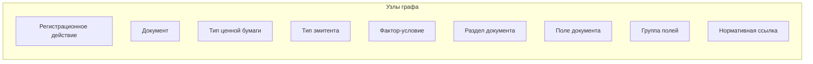
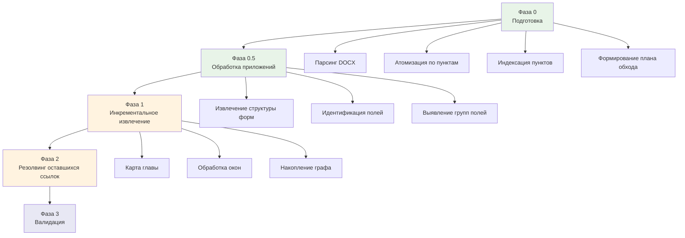

# Постановка задачи: построение графа знаний по 706-П

## 1. Цель проекта

Построить полную структурированную модель (граф знаний) документов, требуемых при регистрации ценных бумаг в Российской Федерации, на основании Положения Банка России №706-П.

Конечный результат — JSON-представление графа, пригодное для:
- Визуализации (интерактивные диаграммы)
- Формирования пакетов документов по заданным параметрам
- Анализа и оптимизации регуляторных процессов
- Перехода к XSD-схемам документов

## 2. Покрытие

### 2.1. Типы ценных бумаг
- Акция обыкновенная
- Акция привилегированная
- РДР (российская депозитарная расписка)
- Облигация корпоративная
- Облигация структурная
- Облигация конвертируемая
- Облигация субординированная
- Облигация с ипотечным покрытием
- Опцион эмитента

### 2.2. Регистрационные действия (полный цикл)
Полный перечень регистрационных действий извлекается из 706-П на этапе обработки. Предварительный (неполный) список:
- Регистрация выпуска
- Регистрация дополнительного выпуска
- Регистрация проспекта ценных бумаг
- Регистрация программы облигаций
- Регистрация изменений (в решение о выпуске, в проспект, в программу облигаций, в условия размещения)
- Предварительное рассмотрение документов
- Отчёт об итогах выпуска / уведомление об итогах
- Уведомления (о представителе владельцев облигаций, о залоговых счетах, об изменении сведений, и др.)
- Аннулирование / признание выпуска несостоявшимся
- Приобретение публичного статуса

### 2.3. Нормативные источники
- **Основной:** Положение Банка России №706-П (DOCX)
- **Вспомогательные (второй слой):** ФЗ «О рынке ценных бумаг», ФЗ «Об акционерных обществах» — для уточнения требований, не детализированных в 706-П (например, определение уполномоченного органа)

## 3. Архитектура графа знаний

### 3.1. Подход
Labeled Property Graph (LPG): узлы с типами и свойствами, рёбра с типами, свойствами и условиями. JSON — формат сериализации.

### 3.2. Типы узлов



#### Регистрационное действие (registration_action)
Тип обращения эмитента в Банк России.
- `id`: уникальный идентификатор
- `name`: наименование
- `legal_ref`: ссылка на пункт(ы) 706-П
- `description`: краткое описание

#### Документ (document)
Документ, фигурирующий в процедурах регистрации.
- `id`: уникальный идентификатор
- `name`: каноническое наименование
- `synonyms`: альтернативные наименования из текста 706-П
- `legal_ref`: ссылка на пункт(ы) 706-П
- `appendix_ref`: ссылка на приложение (если есть форма)
- `type`: form | supporting | notification | report

#### Тип ценной бумаги (security_type)
- `id`: уникальный идентификатор
- `name`: наименование
- `attributes`: набор атрибутов (конвертируемость, структурность, обеспечение и др.)

#### Тип эмитента (issuer_type)
Комбинация юридической формы и типа регулирования.
- `id`: уникальный идентификатор
- `legal_form`: НАО | ПАО
- `regulation_type`: кредитная организация | НФО | нефинансовая организация
- `legal_ref`: ссылка на определение в 706-П или ФЗ

#### Фактор-условие (condition)
Любой фактор, влияющий на состав документов или порядок действий.
- `id`: уникальный идентификатор
- `name`: наименование (вид подписки, способ размещения, наличие проспекта и др.)
- `values`: перечень допустимых значений
- `legal_ref`: ссылка на определение

#### Раздел документа (document_section)
Структурная единица внутри документа-формы (из приложений).
- `id`: уникальный идентификатор
- `document_id`: ссылка на родительский документ
- `parent_section_id`: ссылка на родительский раздел (для иерархии)
- `name`: наименование раздела
- `order`: порядковый номер

#### Поле документа (document_field)
Атомарная единица данных внутри формы документа.
- `id`: уникальный идентификатор
- `name`: наименование поля
- `section_id`: ссылка на раздел
- `data_type`: тип данных (текст, дата, число, выбор и др.)
- `description`: описание / требования к заполнению
- `legal_ref`: ссылка на пункт 706-П, определяющий требования к полю

#### Группа полей (field_group)
Именованная группа полей, переиспользуемая в нескольких документах.
- `id`: уникальный идентификатор
- `name`: наименование
- `fields`: список полей

#### Нормативная ссылка (legal_reference)
Пункт или приложение 706-П (а также ФЗ).
- `id`: уникальный идентификатор
- `source`: 706-П | ФЗ-39 | ФЗ-208
- `paragraph`: номер пункта / приложения
- `text_excerpt`: краткая цитата (для трассировки)

### 3.3. Типы рёбер

#### Рёбра между документами и регистрационными действиями
| Тип ребра | Описание | Свойства |
|-----------|----------|----------|
| `requires_document` | Регистрационное действие требует документ | `conditions`: набор условий; `legal_ref` |
| `replaces_document` | Документ X заменяется документом Y | `conditions`; `legal_ref` |
| `excludes_document` | Документ исключается при определённых условиях | `conditions`; `legal_ref` |

#### Рёбра между регистрационными действиями и типами бумаг / эмитентов
| Тип ребра | Описание | Свойства |
|-----------|----------|----------|
| `applicable_to_security` | Действие применимо к типу бумаги | `conditions` |
| `applicable_to_issuer` | Действие применимо к типу эмитента | `conditions` |
| `depends_on_condition` | Действие зависит от фактора-условия | `condition_values` |

#### Рёбра для полей документов
| Тип ребра | Описание | Свойства |
|-----------|----------|----------|
| `belongs_to` | Поле входит в раздел | `order` |
| `same_as` | Одно и то же поле в разных документах | `confidence`; `notes` |
| `variant_of` | Похожее поле с отличиями | `differences`; `notes` |
| `reused_in` | Группа полей переиспользуется в документе | — |

#### Рёбра для нормативных ссылок
| Тип ребра | Описание | Свойства |
|-----------|----------|----------|
| `defined_by` | Сущность определяется нормативной ссылкой | — |
| `cross_references` | Пункт ссылается на другой пункт | `ref_type`: includes | modifies | overrides |
| `detail_from_fz` | Детализация из ФЗ | `fz_ref`; `detail` |

### 3.4. Модель условий (conditions)

Условия на рёбрах описывают, при каких значениях факторов ребро активно. Формат:

```json
{
  "conditions": {
    "operator": "AND",
    "clauses": [
      {"factor": "issuer_type.legal_form", "op": "eq", "value": "PAO"},
      {
        "operator": "OR",
        "clauses": [
          {"factor": "subscription_type", "op": "eq", "value": "open"},
          {"factor": "has_prospectus", "op": "eq", "value": true}
        ]
      }
    ]
  }
}
```

Это позволяет описывать сложные комбинации условий и в дальнейшем программно вычислять, какие рёбра активны для заданного набора параметров.

## 4. Архитектура конвейера обработки

### 4.1. Общая схема



### 4.2. Фаза 0: Подготовка (детерминированная, скрипт без LLM)

**Вход:** 706-П в формате DOCX.

**Операции:**
1. Парсинг DOCX с сохранением структуры заголовков (python-docx)
2. Разбиение на атомарные единицы — каждый пункт сохраняется отдельно (файл или запись в БД) с метаданными: номер пункта, глава, раздел
3. Построение индекса: номер пункта → текст пункта (для tool calling)
4. Построение индекса: номер приложения → структура приложения
5. Формирование плана обхода (порядок обработки глав)

**Выход:**
- Индексированная база пунктов
- Индекс приложений
- План обхода

**Выбор хранилища:** SQLite — достаточно для объёма 706-П, легко интегрируется с Python, поддерживает полнотекстовый поиск (FTS5). Альтернатива — файловая система (один JSON на пункт), проще в реализации, но менее удобна для сложных запросов.

### 4.3. Фаза 0.5: Обработка приложений (скрипт + LLM)

**Вход:** тексты приложений 1–39 из индекса.

**Операции:**
1. Для каждого приложения — LLM извлекает иерархическую структуру:
   - Разделы → подразделы → поля
   - Для каждого поля: наименование, тип данных, описание
2. Идентификация повторяющихся полей и групп полей (same_as, variant_of)
3. Формирование узлов: document, document_section, document_field, field_group
4. Формирование рёбер: belongs_to, same_as, variant_of, reused_in

**Выход:** подграф форм документов, загруженный в граф.

**Особенность:** приложения обрабатываются до основного текста, чтобы при обработке глав ссылки на приложения резолвились мгновенно.

### 4.4. Фаза 1: Инкрементальное извлечение (LangGraph-агент + оркестратор)

#### Общий принцип

Каждое окно текста обрабатывается LangGraph-агентом в режиме ReAct-цикла. Агент имеет доступ к инструментам (tools) и работает до завершения извлечения.

Граф знаний **накапливается инкрементально**: каждый вызов агента обновляет общий граф.

#### Двухуровневая обработка главы

Для каждой главы:

**Уровень 1 — карта главы.** LLM получает полный текст главы и создаёт компактную карту:
- О чём глава (типы бумаг, регистрационные действия)
- Какие пункты о чём
- Какие условные конструкции присутствуют (если..., то..., за исключением...)
- Какие перекрёстные ссылки

**Уровень 2 — детальный проход по окнам.** Для каждого окна (адаптивная нарезка по пунктам, ~2–3K токенов) агент получает:
- Текст окна
- Карту главы (из уровня 1)
- Компактный реестр сущностей графа (ID + каноническое название)
- Pending refs, target которых попадает в диапазон пунктов окна
- Доступ к tools

#### Инструменты агента (tools)

| Инструмент | Реализация | Назначение |
|------------|-----------|------------|
| `get_paragraph(numbers[])` | Прямой поиск по индексу (без LLM) | Получить текст пункта(ов) — для резолвинга обратных ссылок |
| `get_appendix(number)` | Прямой поиск по индексу (без LLM) | Получить структуру приложения |
| `search_graph(query)` | LLM-нечёткий поиск по графу | Найти сущность по описанию (для дедупликации) |
| `get_node(id)` | Прямой запрос к графу (без LLM) | Получить полное описание узла |
| `get_edges(node_id)` | Прямой запрос к графу (без LLM) | Получить связи узла |
| `update_graph(operations[])` | Запись в граф (без LLM) | Добавить/обновить узлы и рёбра |
| `add_pending_ref(ref)` | Запись в реестр ссылок (без LLM) | Зарегистрировать прямую ссылку |
| `resolve_ref(ref_id, resolution)` | Обновление реестра (без LLM) | Закрыть ранее зарегистрированную ссылку |

**Батчевость:** tools принимают массивы (несколько пунктов, несколько ссылок за один вызов).

#### Порядок обработки глав (нелинейный)

Обработка ведётся по ветвям зависимостей, а не линейно:


**Зависимости:** каждая ветвь обрабатывается после своих зависимостей. Ветви одного уровня могут обрабатываться в любом порядке (или параллельно, при наличии инфраструктуры).

**Контроль полноты:** скрипт ведёт чеклист всех глав и пунктов. После завершения — проверка покрытия.

### 4.5. Фаза 2: Резолвинг оставшихся ссылок (скрипт + LLM)

**Вход:** граф + реестр pending_refs со статусом `unresolved`.

**Операции:**
1. Для каждой неразрешённой ссылки — извлечь текст целевого пункта из индекса
2. LLM получает: текст пункта + контекст ссылающейся сущности + фрагмент графа → устанавливает связь

**Выход:** граф с разрешёнными ссылками. Ссылки, которые не удалось разрешить автоматически, помечаются для ручной валидации.

### 4.6. Фаза 3: Валидация (диалог с Claude)

**Операции:**
1. **Проверка полноты по типам бумаг:** для каждого типа бумаги из п. 2.1 — есть ли покрытие всех регистрационных действий?
2. **Проверка консистентности условий:** нет ли противоречивых рёбер (один и тот же документ одновременно требуется и исключается при одинаковых условиях)?
3. **Разрешение аномалий:** неразрешённые ссылки, дубликаты с низкой confidence, variant_of без описания различий
4. **Сверка с ФЗ (второй слой):** обогащение графа данными из ФЗ «О рынке ценных бумаг» и ФЗ «Об АО» (уполномоченные органы, сроки, дополнительные требования)
5. **Выборочная сверка с текстом:** для нескольких конкретных сценариев — ручная проверка корректности извлечённого графа

## 5. Распределение функций

### 5.1. Детерминированные операции (скрипт, без LLM)

| Операция | Описание |
|----------|----------|
| Парсинг DOCX | Извлечение текста с сохранением структуры |
| Атомизация | Разбиение на пункты, индексация |
| Нарезка на окна | Адаптивная нарезка по пунктам (~2–3K токенов) |
| Формирование плана обхода | Топологическая сортировка глав |
| Оркестрация конвейера | Управление порядком обработки, передача состояния |
| Tools (get_paragraph, get_node, get_edges, update_graph) | Прямые запросы к индексу и графу |
| Контроль полноты | Чеклист глав и пунктов |
| Экспорт графа | Сериализация в JSON |

### 5.2. LLM в скрипте (OpenAI API, массовые вызовы)

| Операция | Описание |
|----------|----------|
| Извлечение структуры приложений | Иерархия разделов и полей |
| Идентификация same_as / variant_of полей | Сопоставление полей между приложениями |
| Карта главы (уровень 1) | Обзорное описание содержания главы |
| Детальное извлечение из окна (уровень 2) | Извлечение сущностей, условий, ссылок |
| Нечёткий поиск по графу (tool: search_graph) | Поиск существующей сущности по описанию |
| Резолвинг ссылок | Установление связей по перекрёстным ссылкам |

### 5.3. LLM в диалоге (Claude, интеллектуальные операции)

| Операция | Описание |
|----------|----------|
| Валидация полноты | Проверка покрытия по типам бумаг и действиям |
| Разрешение аномалий | Анализ противоречий и неоднозначностей |
| Сверка с ФЗ | Обогащение графа вторым слоем |
| Калибровка промптов | Тестирование и доработка промптов на реальных фрагментах |
| Архитектурные решения | Уточнение схемы графа по мере обнаружения новых паттернов |

## 6. Стек технологий

| Компонент | Технология |
|-----------|-----------|
| Парсинг DOCX | python-docx |
| Хранение пунктов | SQLite (с FTS5) или файловая система |
| Хранение графа | JSON на диске (с периодическими снапшотами) |
| Агент обработки окон | LangGraph (ReAct) |
| LLM API | OpenAI |
| Оркестрация | Python-скрипт |
| Валидация | Диалог с Claude |

## 7. Открытые вопросы

### 7.1. Размер карты главы
Если глава содержит 9 страниц, карта главы может быть слишком объёмной для удержания в контексте вместе с окном и реестром. Возможно, потребуется компактификация или сегментация карты.

**Решение:** определяется эмпирически при калибровке на главе 34.

### 7.2. Гранулярность полей документов
Насколько детально извлекать поля из приложений? Некоторые приложения содержат вложенные таблицы и сложные условные структуры.

**Решение:** начать с верхнего уровня иерархии, углублять по потребности.

### 7.3. Обработка «утративших силу» элементов
В приложениях встречаются пометки «Утратили силу». Включать ли такие элементы в граф?

**Предварительное решение:** не включать, но логировать для справки.

### 7.4. Параллельная обработка
Ветви одного уровня теоретически можно обрабатывать параллельно. Это требует механизма конкурентного доступа к графу.

**Предварительное решение:** на первом этапе — последовательная обработка. Параллельность — оптимизация на будущее.

### 7.5. JSON-схема графа
Конкретная JSON-схема (формат узлов, рёбер, условий) будет уточнена после калибровки на реальном тексте (глава 34).

## 8. Следующие шаги

1. **Калибровка на главе 34:** загрузка главы 34 в диалог, формирование предложений по промптам и JSON-схеме
2. **Реализация Фазы 0:** скрипт парсинга и атомизации 706-П
3. **Реализация Фазы 0.5:** обработка приложений
4. **Реализация Фазы 1:** LangGraph-агент + оркестратор
5. **Итеративная доработка:** по результатам каждой фазы — уточнение схемы и промптов
