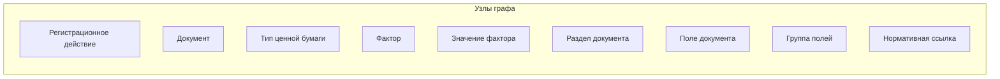
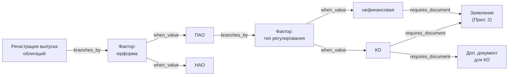
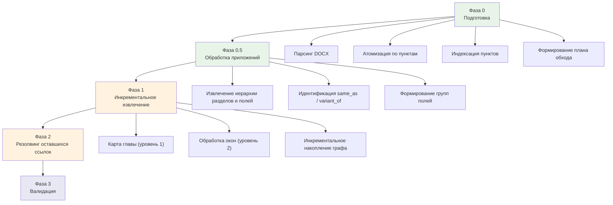

# Постановка задачи: построение графа знаний по 706-П

## 1. Цель проекта

Построить полную структурированную модель (граф знаний) документов, требуемых при регистрации ценных бумаг в Российской Федерации, на основании Положения Банка России №706-П.

Конечный результат — JSON-представление графа, пригодное для:
- Визуализации (интерактивные диаграммы)
- Формирования пакетов документов по заданным параметрам
- Анализа и оптимизации регуляторных процессов
- Перехода к XSD-схемам документов

## 2. Покрытие

### 2.1. Типы ценных бумаг
- Акция обыкновенная
- Акция привилегированная
- РДР (российская депозитарная расписка)
- Облигация корпоративная
- Облигация структурная
- Облигация конвертируемая
- Облигация субординированная
- Облигация с ипотечным покрытием
- Опцион эмитента

### 2.2. Регистрационные действия (полный цикл)
Полный перечень регистрационных действий извлекается из 706-П на этапе обработки. Предварительный (неполный) список:
- Регистрация выпуска
- Регистрация дополнительного выпуска
- Регистрация проспекта ценных бумаг
- Регистрация программы облигаций
- Регистрация изменений (в решение о выпуске, в проспект, в программу облигаций, в условия размещения)
- Предварительное рассмотрение документов
- Отчёт об итогах выпуска / уведомление об итогах
- Уведомления (о представителе владельцев облигаций, о залоговых счетах, об изменении сведений, и др.)
- Аннулирование / признание выпуска несостоявшимся
- Приобретение публичного статуса

Допускается, что регистрационные действия образуют иерархию (например, «регистрация выпуска» → «регистрация выпуска акций при учреждении» как дочернее действие). Структура иерархии уточняется при обработке текста.

### 2.3. Нормативные источники
- **Основной:** Положение Банка России №706-П (DOCX)
- **Вспомогательные:** ФЗ «О рынке ценных бумаг» (ФЗ-39), ФЗ «Об акционерных обществах» (ФЗ-208)

Вспомогательные ФЗ в рамках данного проекта **не обрабатываются**. При обработке 706-П формируется бэклог вопросов к ФЗ — реестр мест, где 706-П ссылается на ФЗ или оставляет неопределённость, которую ФЗ закрывает (например, определение уполномоченного органа для принятия решения о выпуске). Формат записи бэклога:

```json
{
  "type": "fz_question",
  "source_node": "field:authorized_body_decision",
  "source_legal_ref": "п. 34.5 706-П",
  "question": "Какой орган является уполномоченным для принятия решения о выпуске акций?",
  "expected_source": "ФЗ-208",
  "expected_articles": ["ст. 28", "ст. 39"],
  "status": "open"
}
```

## 3. Архитектура графа знаний

### 3.1. Подход
Labeled Property Graph (LPG): узлы с типами и свойствами, рёбра с типами и свойствами. JSON — формат сериализации.

### 3.2. Типы узлов



#### Регистрационное действие (registration_action)
Конкретная процедура, предусмотренная 706-П, результатом которой является юридический факт: зарегистрирован выпуск, присвоен номер, утверждены изменения, принят отчёт и т.д. Каждое действие порождает свой набор требуемых документов и условий.
- `id`: уникальный идентификатор
- `name`: наименование
- `parent_id`: ссылка на родительское действие (для иерархии), nullable
- `legal_ref`: ссылка на пункт(ы) 706-П
- `description`: краткое описание

#### Документ (document)
Документ, фигурирующий в процедурах регистрации.
- `id`: уникальный идентификатор
- `name`: каноническое наименование
- `synonyms`: альтернативные наименования из текста 706-П
- `legal_ref`: ссылка на пункт(ы) 706-П
- `appendix_ref`: ссылка на приложение (если есть утверждённая форма)
- `type`: form | supporting | notification | report

#### Тип ценной бумаги (security_type)
- `id`: уникальный идентификатор
- `name`: наименование
- `attributes`: набор атрибутов (конвертируемость, структурность, обеспечение и др.)

#### Фактор (factor)
Именованная ось классификации, влияющая на состав документов или порядок действий. Конкретные значения фактора — отдельные узлы (см. ниже).

Предварительный (неполный) перечень факторов:
- Юридическая форма эмитента (ПАО, НАО, ООО, госкорпорация, иные)
- Тип эмитента по регулированию (КО, НФО, нефинансовая организация)
- Специальный статус эмитента (специализированное общество, ипотечный агент)
- Вид подписки (открытая, закрытая)
- Способ размещения (учреждение, распределение, подписка, конвертация, реорганизация)
- Форма реорганизации (слияние, присоединение, разделение, выделение, преобразование)
- Наличие / отсутствие проспекта
- Тип обеспечения облигаций (ипотечное покрытие, залог, поручительство, без обеспечения)

Юридическая форма и тип по регулированию — **два независимых фактора**, а не один «тип эмитента». Каждый влияет на состав документов по-своему: юрформа определяет корпоративные решения, тип по регулированию — регистратора и специфические требования.

Полный перечень факторов и их значений извлекается из 706-П на этапе обработки.

- `id`: уникальный идентификатор
- `name`: наименование фактора
- `legal_ref`: ссылка на определение в 706-П

#### Значение фактора (factor_value)
Конкретное значение фактора. Является отдельным узлом, потому что к нему привязываются рёбра (какие документы требуются при данном значении).
- `id`: уникальный идентификатор
- `factor_id`: ссылка на родительский фактор
- `name`: наименование значения
- `legal_ref`: ссылка на определение

#### Раздел документа (document_section)
Структурная единица внутри документа-формы (из приложений).
- `id`: уникальный идентификатор
- `document_id`: ссылка на родительский документ
- `parent_section_id`: ссылка на родительский раздел (для иерархии), nullable
- `name`: наименование раздела
- `order`: порядковый номер

#### Поле документа (document_field)
Атомарная единица данных внутри формы документа. Является узлом графа (а не вложенным атрибутом раздела), чтобы отслеживать переиспользование одних и тех же полей в разных документах и в перспективе переходить к XSD-схемам.
- `id`: уникальный идентификатор
- `name`: наименование поля
- `section_id`: ссылка на раздел
- `data_type`: тип данных (текст, дата, число, выбор и др.)
- `description`: описание / требования к заполнению
- `legal_ref`: ссылка на пункт 706-П, определяющий требования к полю

#### Группа полей (field_group)
Именованная группа полей, переиспользуемая в нескольких документах. Кандидат на reusable complex type в XSD.
- `id`: уникальный идентификатор
- `name`: наименование (например, «Вид, категория (тип), идентификационные признаки ценных бумаг»)

#### Нормативная ссылка (legal_reference)
Пункт или приложение 706-П.
- `id`: уникальный идентификатор
- `source`: 706-П
- `paragraph`: номер пункта / приложения
- `text_excerpt`: краткая цитата (для трассировки)

### 3.3. Типы рёбер

#### Рёбра между регистрационными действиями и документами
| Тип ребра | Описание | Свойства |
|-----------|----------|----------|
| `requires_document` | Действие требует документ | `legal_ref` |
| `replaces_document` | Документ X заменяется документом Y при определённых условиях | `legal_ref` |
| `excludes_document` | Документ исключается из пакета при определённых условиях | `legal_ref` |

#### Рёбра для условий и развилок
| Тип ребра | Описание | Свойства |
|-----------|----------|----------|
| `branches_by` | Регистрационное действие (или промежуточный узел) разветвляется по фактору | `factor_id` |
| `when_value` | Ветвь, соответствующая конкретному значению фактора | `factor_value_id` |

Модель условий реализуется через **узлы-развилки**: регистрационное действие → развилка по фактору → значение фактора → следующая развилка или документ. Для ключевых факторов с малым числом значений (юрформа, тип регулирования, вид подписки, способ размещения) — развилки в графе. Для редких частных случаев — условия как свойства рёбер. Баланс между этими подходами уточняется при калибровке.

#### Рёбра для полей документов
| Тип ребра | Описание | Свойства |
|-----------|----------|----------|
| `belongs_to` | Поле входит в раздел | `order` |
| `contains_field` | Группа полей содержит поле | `order` |
| `same_as` | Одно и то же поле в разных документах | `confidence`; `notes` |
| `variant_of` | Похожее поле с отличиями | `differences`; `notes` |
| `reused_in` | Группа полей переиспользуется в документе | `section_id` |

#### Рёбра для нормативных ссылок
| Тип ребра | Описание | Свойства |
|-----------|----------|----------|
| `defined_by` | Сущность определяется нормативной ссылкой | — |
| `cross_references` | Пункт ссылается на другой пункт | `ref_type`: includes | modifies | overrides |

### 3.4. Модель условий

Условия реализуются двумя механизмами:

**Механизм 1 — узлы-развилки (основной).** Для ключевых факторов: юрформа, тип регулирования, вид подписки, способ размещения, форма реорганизации. Развилка — это путь через граф:



Комбинаторный взрыв при таком подходе допустим — задача требует точного отражения всех комбинаций.

**Механизм 2 — условия на рёбрах (для частных случаев).** Для редких условий, которые нецелесообразно оформлять как развилку:

```json
{
  "from": "ra:reg_bond_issue",
  "to": "doc:mortgage_coverage_report",
  "type": "requires_document",
  "condition_note": "только при наличии ипотечного покрытия и если эмитент — ипотечный агент",
  "legal_ref": "п. 59.3 706-П"
}
```

## 4. Архитектура конвейера обработки

### 4.1. Общая схема



### 4.2. Фаза 0: Подготовка (детерминированная, скрипт без LLM)

**Вход:** 706-П в формате DOCX.

**Операции:**
1. Парсинг DOCX с сохранением структуры заголовков (python-docx)
2. Разбиение на атомарные единицы — каждый пункт сохраняется отдельно с метаданными: номер пункта, глава, раздел
3. Построение индекса: номер пункта → текст пункта (для tool calling)
4. Построение индекса: номер приложения → текст приложения
5. Формирование плана обхода (топологическая сортировка глав по зависимостям)

**Выход:**
- Индексированная база пунктов (SQLite с FTS5 или файловая система)
- Индекс приложений
- План обхода

### 4.3. Фаза 0.5: Обработка приложений (скрипт + LLM)

**Вход:** тексты приложений 1–39 из индекса.

**Операции:**
1. Для каждого приложения — LLM извлекает **иерархическую** структуру:
   - Разделы → подразделы → поля (с сохранением вложенности, а не плоским списком)
   - Для каждого поля: наименование, тип данных, описание
2. Идентификация повторяющихся полей и групп полей между приложениями (same_as, variant_of)
3. Формирование узлов: document, document_section, document_field, field_group
4. Формирование рёбер: belongs_to, contains_field, same_as, variant_of, reused_in

**Выход:** подграф форм документов, загруженный в граф.

**Особенность:** приложения обрабатываются до основного текста, чтобы при обработке глав ссылки на приложения резолвились мгновенно.

**Элементы с пометкой «Утратили силу»:** не включаются в граф, но логируются для справки.

### 4.4. Фаза 1: Инкрементальное извлечение (LangGraph-агент + оркестратор)

#### Общий принцип

Каждое окно текста обрабатывается LangGraph-агентом в режиме ReAct-цикла. Агент имеет доступ к инструментам (tools) и работает до завершения извлечения. Многошаговый диалог на одно окно — норма; приоритет — точность, а не скорость.

Граф знаний **накапливается инкрементально**: каждый вызов агента обновляет общий граф.

#### Двухуровневая обработка главы

Для каждой главы:

**Уровень 1 — карта главы.** LLM получает полный текст главы и создаёт компактную карту:
- О чём глава (типы бумаг, регистрационные действия)
- Какие пункты о чём
- Какие условные конструкции присутствуют (если…, то…, за исключением…)
- Какие перекрёстные ссылки

**Уровень 2 — детальный проход по окнам.** Для каждого окна (адаптивная нарезка по пунктам, ~2–3K токенов) агент получает:
- Текст окна
- Карту главы (из уровня 1)
- Компактный реестр сущностей графа (ID + каноническое название)
- Pending refs, target которых попадает в диапазон пунктов окна
- Доступ к tools

#### Инструменты агента (tools)

| Инструмент | Реализация | Назначение |
|------------|-----------|------------|
| `get_paragraphs(numbers[])` | Прямой поиск по индексу (без LLM) | Получить тексты пунктов — для резолвинга обратных ссылок. Батчевый. |
| `get_appendix(number)` | Прямой поиск по индексу (без LLM) | Получить структуру приложения |
| `search_graph(query)` | LLM-нечёткий поиск по графу | Найти сущность по описанию (для дедупликации) |
| `get_node(id)` | Прямой запрос к графу (без LLM) | Получить полное описание узла |
| `get_edges(node_id)` | Прямой запрос к графу (без LLM) | Получить связи узла |
| `update_graph(operations[])` | Запись в граф (без LLM) | Добавить/обновить узлы и рёбра. Батчевый. |
| `add_pending_refs(refs[])` | Запись в реестр ссылок (без LLM) | Зарегистрировать прямые ссылки. Батчевый. |
| `resolve_refs(resolutions[])` | Обновление реестра (без LLM) | Закрыть ранее зарегистрированные ссылки. Батчевый. |

#### Стратегия работы со ссылками

**Предварительная индексация:** при атомизации документа (Фаза 0) для каждого пункта сохраняется диапазон номеров. Это позволяет быстро определить, попадает ли target ссылки в текущее окно.

**При обработке окна W (содержит пункты N..M):**
1. Оркестратор проверяет pending_refs: есть ли ссылки с target в диапазоне N..M? → добавляет их в контекст агента
2. Агент находит новые ссылки в тексте:
   - Ссылка назад (target < N): агент вызывает `get_paragraphs()` + `search_graph()` → резолвит сразу
   - Ссылка вперёд (target > M): агент вызывает `add_pending_refs()`
   - Ссылка на приложение: агент вызывает `get_appendix()` → резолвит сразу (приложения уже обработаны)

#### Управление контекстом

**Компактный реестр сущностей** (ID + каноническое название, ~50–100 токенов на сущность) — всегда в контексте агента. Позволяет сопоставлять встреченные в тексте упоминания с уже известными сущностями.

**Детальная информация** (полные описания узлов, связи) — доступна через tool calls (`get_node`, `get_edges`). В контекст не включается.

При росте графа реестр может превысить допустимый размер контекста. Решение: подавать **релевантный срез реестра**, отфильтрованный по ключевым словам из текущего окна и карты главы.

#### Порядок обработки глав (нелинейный)

Обработка ведётся по ветвям зависимостей:


**Зависимости:** каждая ветвь обрабатывается после своих зависимостей. Ветви одного уровня могут обрабатываться в любом порядке (или параллельно при наличии инфраструктуры).

**Контроль полноты:** скрипт ведёт чеклист всех глав и пунктов. После завершения — проверка покрытия.

### 4.5. Фаза 2: Резолвинг оставшихся ссылок (скрипт + LLM)

**Вход:** граф + реестр pending_refs со статусом `unresolved`.

**Операции:**
1. Для каждой неразрешённой ссылки — извлечь текст целевого пункта из индекса
2. LLM получает: текст пункта + контекст ссылающейся сущности + фрагмент графа → устанавливает связь

**Выход:** граф с разрешёнными ссылками. Ссылки, которые не удалось разрешить автоматически, помечаются для ручной валидации.

### 4.6. Фаза 3: Валидация (диалог с Claude)

**Операции:**
1. **Проверка полноты по типам бумаг:** для каждого типа бумаги из п. 2.1 — есть ли покрытие всех регистрационных действий?
2. **Проверка консистентности условий:** нет ли противоречивых рёбер (один и тот же документ одновременно требуется и исключается при одинаковых условиях)?
3. **Разрешение аномалий:** неразрешённые ссылки, дубликаты с низкой confidence, variant_of без описания различий
4. **Выборочная сверка с текстом:** для нескольких конкретных сценариев — ручная проверка корректности извлечённого графа

Сверка с ФЗ не входит в скоуп данного проекта — вместо неё формируется бэклог вопросов к ФЗ (см. п. 2.3).

## 5. Визуализация

### 5.1. Этап 1 — визуализация для контроля парсинга (в рамках данного проекта)

**Назначение:** оперативная проверка корректности извлечённых данных в процессе итеративной разработки конвейера. Позволяет загрузить текущий JSON графа и убедиться, что сущности и связи извлекаются правильно.

**Тип:** force-directed graph (сетевая диаграмма), D3.

**Требования:**
- Вход: JSON графа (тот же формат, что выдаёт конвейер)
- Узлы окрашены по типу (регистрационное действие, документ, фактор, значение фактора, поле и т.д.)
- При наведении на узел — отображение его свойств
- При клике на узел — подсветка связанных узлов и рёбер
- Фильтрация по типу узла и типу ребра (чекбоксы)
- Возможность выбрать корневой узел и отобразить его окрестность заданной глубины (1, 2, 3 хопа)
- Масштабирование и перетаскивание
- Веб-страница, запускается локально (open index.html)

**Ограничения:** не предназначена для работы с полным графом (сотни/тысячи узлов). Работает на срезах до ~100–150 узлов.

### 5.2. Этап 2 — аналитическая визуализация (отдельная постановка)

**Назначение:** полноценный инструмент исследования графа для аналитических задач (оптимизация, поиск аномалий, формирование пакетов документов).

**Тип:** комбинированный multi-view интерфейс.

**Предварительные требования (уточняются в отдельной постановке):**
- Левая панель: навигация (дерево / список) с выбором точки входа:
  - От регистрационного действия (дерево решений с развилками)
  - От документа (звезда: контексты использования + иерархия полей)
  - От типа бумаги (все действия и документы)
  - От поля / группы полей (карта переиспользования)
- Правая панель: детали выбранного узла (свойства, связи, нормативные ссылки)
- Режим матрицы смежности: строки — действия, столбцы — документы (для проверки полноты)
- Синхронизация панелей: выбор в одной → подсветка в другой
- Поиск по графу

**Реализуется после завершения основного конвейера (Фазы 0–3).**

## 6. Распределение функций

### 6.1. Детерминированные операции (скрипт, без LLM)

| Операция | Описание |
|----------|----------|
| Парсинг DOCX | Извлечение текста с сохранением структуры |
| Атомизация | Разбиение на пункты, индексация |
| Нарезка на окна | Адаптивная нарезка по пунктам (~2–3K токенов) |
| Формирование плана обхода | Топологическая сортировка глав |
| Оркестрация конвейера | Управление порядком обработки, передача состояния |
| Tools (get_paragraphs, get_node, get_edges, update_graph) | Прямые запросы к индексу и графу |
| Контроль полноты | Чеклист глав и пунктов |
| Экспорт графа | Сериализация в JSON |
| Визуализация (этап 1) | Веб-страница с D3 force-directed graph |

### 6.2. LLM в скрипте (OpenAI API)

| Операция | Описание |
|----------|----------|
| Извлечение структуры приложений | Иерархия разделов и полей |
| Идентификация same_as / variant_of полей | Сопоставление полей между приложениями |
| Карта главы (уровень 1) | Обзорное описание содержания главы |
| Детальное извлечение из окна (уровень 2) | Извлечение сущностей, условий, ссылок |
| Нечёткий поиск по графу (tool: search_graph) | Поиск существующей сущности по описанию |
| Резолвинг ссылок | Установление связей по перекрёстным ссылкам |

### 6.3. LLM в диалоге (Claude, интеллектуальные операции)

| Операция | Описание |
|----------|----------|
| Валидация полноты | Проверка покрытия по типам бумаг и действиям |
| Разрешение аномалий | Анализ противоречий и неоднозначностей |
| Калибровка промптов | Тестирование и доработка промптов на реальных фрагментах |
| Архитектурные решения | Уточнение схемы графа по мере обнаружения новых паттернов |

## 7. Стек технологий

| Компонент | Технология |
|-----------|-----------|
| Парсинг DOCX | python-docx |
| Хранение пунктов | SQLite (с FTS5) или файловая система |
| Хранение графа | JSON на диске (с периодическими снапшотами) |
| Агент обработки окон | LangGraph (ReAct) |
| LLM API | OpenAI |
| Оркестрация | Python-скрипт |
| Визуализация (этап 1) | D3.js, статическая веб-страница |
| Визуализация (этап 2) | D3.js, multi-view (отдельная постановка) |
| Валидация | Диалог с Claude |

## 8. Открытые вопросы

### 8.1. Размер карты главы
Если глава содержит 9 страниц, карта главы может быть слишком объёмной для удержания в контексте вместе с окном и реестром. Возможно, потребуется компактификация или сегментация карты.

**Решение:** определяется эмпирически при калибровке на главе 34.

### 8.2. Гранулярность полей документов
Насколько детально извлекать поля из приложений? Некоторые приложения содержат вложенные таблицы и сложные условные структуры.

**Решение:** начать с верхнего уровня иерархии, углублять по потребности.

### 8.3. Обработка «утративших силу» элементов
В приложениях встречаются пометки «Утратили силу».

**Решение:** не включать в граф, но логировать для справки.

### 8.4. Параллельная обработка
Ветви одного уровня теоретически можно обрабатывать параллельно. Это требует механизма конкурентного доступа к графу.

**Решение:** на первом этапе — последовательная обработка. Параллельность — оптимизация на будущее.

### 8.5. Баланс развилок и условий на рёбрах
Какие факторы оформлять как узлы-развилки, а какие — как условия на рёбрах. Слишком много развилок → комбинаторный взрыв (допустим). Слишком много условий на рёбрах → теряется наглядность.

**Решение:** определяется при калибровке на главе 34.

### 8.6. JSON-схема графа
Конкретная JSON-схема (формат сериализации узлов, рёбер, условий) будет уточнена после калибровки на реальном тексте.

## 9. Следующие шаги

1. **Калибровка на главе 34:** загрузка главы 34 в диалог, формирование предложений по промптам и JSON-схеме
2. **Реализация Фазы 0:** скрипт парсинга и атомизации 706-П
3. **Реализация визуализации (этап 1):** D3 force-directed graph для контроля
4. **Реализация Фазы 0.5:** обработка приложений
5. **Реализация Фазы 1:** LangGraph-агент + оркестратор
6. **Итеративная доработка:** по результатам каждой фазы — уточнение схемы и промптов
7. **Постановка визуализации (этап 2):** отдельный документ после завершения Фаз 0–3
